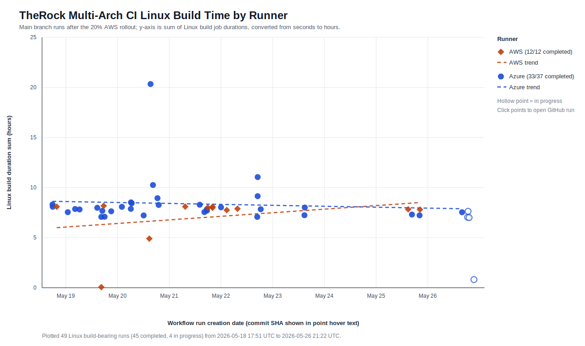

# AWS/Azure Runner Rollout Snapshot

This folder captures the data used to evaluate the TheRock `multi_arch_ci.yml`
main-branch runner split after the AWS runner weight was raised from 10% to 20%
and before PR #5451 proposed raising it to 50%.

## Scope

- Workflow: `ROCm/TheRock` `multi_arch_ci.yml`, workflow id `210763103`.
- Workflow history: https://github.com/ROCm/TheRock/actions/workflows/multi_arch_ci.yml?query=branch%3Amain
- PR #5318: https://github.com/ROCm/TheRock/pull/5318
- PR #5451: https://github.com/ROCm/TheRock/pull/5451
- Window: `2026-05-18T17:51:31Z` through `2026-05-26T21:22:54Z` UTC.
- Start event: PR #5318 merged on 2026-05-18 at 17:51:16 UTC.
- End event: PR #5451 was opened on 2026-05-26 at 21:42:34 UTC.
- Runner classification source: GitHub Actions build-job metadata labels.
- Build time metric: `linux_build_job_seconds_sum`, the sum of Linux build job durations in each workflow run.
- Wall-time proxy: `linux_build_job_seconds_max`, the longest Linux build job duration in each workflow run.

## Files

- `runner_history_enriched.csv`: one row per workflow run in the sampled window.
- `build_time_points.csv`: AWS/Azure build-bearing rows used by the scatterplot.
- `runner_summary.json`: computed counts and performance summaries.
- `runner_history_scatter.svg`: static scatterplot with trend lines.
- `runner_history_scatter.html`: self-contained HTML wrapper with clickable/hoverable SVG points.
- `ccache_sample_summary.csv`: preliminary ccache comparison for one Azure run and one AWS run.
- `ccache_sample.json`: detailed parsed ccache sample by run and stage.
- `generate_report.py`: regenerates the tabular summaries and report from the cached GitHub metadata snapshots.

## Runner Mix

| Runner class | Runs | Share of all runs | Linux build jobs | Share of Linux build jobs |
| --- | ---: | ---: | ---: | ---: |
| AWS | 12 | 20.7% | 147 | 23.0% |
| Azure | 37 | 63.8% | 492 | 77.0% |
| No Linux build jobs | 9 | 15.5% | 0 | n/a |

AWS represented `12/49` build-bearing runs (24.5%) and `147/639` Linux build jobs (23.0%).

## Build Duration

These summaries use completed AWS/Azure build-bearing workflow runs only.

| Runner | n | Mean seconds-sum (h) | Median seconds-sum (h) | Median longest job (min) |
| --- | ---: | ---: | ---: | ---: |
| AWS | 12 | 7.06 | 7.93 | 103.6 |
| Azure | 33 | 8.39 | 7.86 | 109.9 |

A couple of AWS runs failed very early. Filtering to completed runs with at least 6 hours
of summed Linux build time gives this less outlier-sensitive view:

| Runner | n | Mean seconds-sum (h) | Median seconds-sum (h) | Median longest job (min) |
| --- | ---: | ---: | ---: | ---: |
| AWS | 10 | 7.97 | 7.99 | 103.7 |
| Azure | 33 | 8.39 | 7.86 | 109.9 |

## Interpretation

The observed build-duration data does not yet show a clear 10-20% AWS speedup.
On the summed build-job duration metric, the completed-run medians are effectively
tied. The longest-job proxy gives AWS a modest advantage, but still below the
expected range and based on only 12 completed AWS build-bearing runs.

This should be treated as an early signal, not a final benchmark. The sample is
small, most build-bearing workflow conclusions in this window are failures, and
run-to-run commit changes can dominate small infrastructure effects.

## Ccache Sample

| Run | Runner | Hits | Misses | Hit rate |
| --- | --- | ---: | ---: | ---: |
| 26418270338 | AWS | 7104 | 93960 | 7.0% |
| 26459293626 | Azure | 97509 | 3563 | 96.5% |

This is only a two-run sample, but it is important context: the sampled AWS run
had a much colder ccache profile than the sampled Azure run. If that pattern is
real across more runs, cache behavior could be masking runner hardware or S3
locality gains.

## Evidence Expectations For Future Rollout PRs

For future runner migration or weight-change PRs, authors should include:

- Actual observed runner split by run and by job, with date range and exclusions.
- Build duration distributions by runner, not only averages.
- Outlier handling, especially early-aborted workflow runs.
- Ccache hit-rate distributions by runner and by major build stage.
- Artifact download/upload timing by runner, if S3 locality is part of the argument.
- A plain statement of whether the observed effect matches the expected effect size.

## Reproduction Notes

The public GitHub REST API exposed workflow run and job metadata, including runner
labels and job timestamps. GitHub's workflow-jobs documentation says public job logs
can be downloaded without authentication, but during this investigation unauthenticated
`curl` still returned HTTP 403 for the setup-job log endpoint, including with the
`X-GitHub-Api-Version: 2026-03-10` header. Because of that observed behavior, the
first collection pass classified runner type from build-job labels instead of parsing
the setup job's `Configuring CI options` log step.

An authenticated `gh` session can fetch setup-job logs for this repository. For example,
`gh api --verbose repos/ROCm/TheRock/actions/jobs/77902236703/logs` returns a 302
to a signed log blob, and that log contains the same Linux `build_runs_on` value
shown by the Linux build-job labels. A future parser can use those setup logs directly
when authenticated `gh` credentials are available.

