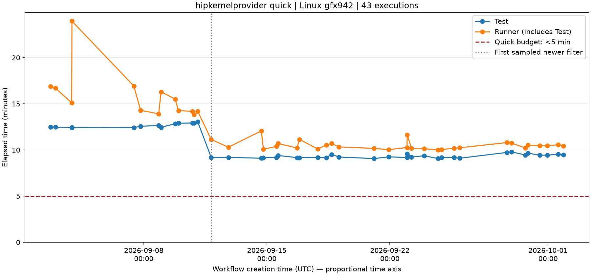

# hipkernelprovider quick exceeds its budget across a 30-day sample

hipkernelprovider's quick tests average **10m19s against a [<5m budget][budget]** across 43 sampled executions; all exceed the budget. The newer filter group improves to **9m19s**, still over budget. These are Test-step wall times, excluding job setup but including in-step initialization—not GPU kernel timings.

## Evidence

We sampled push-event workflows to ROCm/TheRock over **September 2–October 1, 2026**, using `linux-gfx942-1gpu-ccs-csp-ossci-rocm`. The bounded search found 43 quick executions across 23 days; all succeeded. These are first-attempt Linux release jobs, one shard each. The target was 50; collection stopped at the agreed API cap.

| Logged HIP_MLOPS filter group | Samples | Average Test time | Range |
| --- | ---: | ---: | --- |
| Older: `quick_*:Smoke/*` | 13 | 12m39s | 12m24s–13m03s |
| Newer: adds `Quick/*` | 30 | 9m19s | 9m04s–9m48s |

Both filters exclude disabled cases. The last sampled older filter is September 11 at 01:43 UTC; the first newer one is 20:09 UTC that day. The newer group is **26% faster**, but case counts also change: this is not a controlled speedup measurement. [Test-tier rebalancing PR #11884][retiering] changed these filters; artifact/component lineage remains to be verified before attributing the entire improvement.

In the [October 1 sample job][sample], HIP_MLOPS dominates. Links below point to engine filters and quick case inputs.

| Suite / inputs | Wall time (s) | Selected | Passed | Skipped |
| --- | ---: | ---: | ---: | ---: |
| Provider unit + integration | 3.94 | 638 | 632 | 6 |
| [HIP_MLOPS external integration][mlops] ([cases][bundles]) | 519.81 | 3,575 | 2,144 | 1,431 |
| [ASM_SDPA external integration][sdpa] ([cases][sdpa-cases]) | 45.36 | 26 | 0 | 26 |

These are GoogleTest cases, not CTest wrappers. Combined wall time is 569.11s, or **134ms per selected case**, amortizing skipped cases and initialization. That average is not a typical executed GPU test's duration.

## Suggested actions

- **Narrow quick's combinations while retaining smoke coverage.** In the sample job, `quick_Layernorm_Default` takes 143s for 168 cases; Layernorm Variant2 adds 19s for 60; fused Batchnorm inference/backward takes 53s for 144. Keep representative shapes/types and move broader coverage upward. The newer group's mean needs another **259s (46%) reduction**, plus margin.
- **Fix all-skipped overhead.** ASM_SDPA passes zero cases in **all 43 samples**, costing **32–52s per execution**. Investigate early capability gating or a supported smoke path; a passing wrapper is not useful coverage. In the October 1 job, HIP_MLOPS also spends ~46s outside its reported GoogleTest execution interval.
- **Do not rely on batching or tighter timeouts alone.** For the newer group, all non-Test time is only **11.2%** of runner occupancy. Removing it would still leave 9m19s of Test time. Timeout failures are not speedups.

Acceptance: successful quick completion below 5m with margin on this runner, before/after case counts and artifact revisions, displaced cases retained in higher tiers, and another time-stratified public sample. Do not count new skips or lost coverage as an improvement.

Sampling, reproducibility and triage details

Inventory: 297 main-push runs in 30 complete UTC days. Candidates were ordered deterministically within each day, independent of outcome. Seek one/day, then evenly distribute extra slots and redistribute gaps. This is not a uniform or calendar-weighted estimate of every execution in the month.

September 6, 20 and 27 had no main-push workflows. September 4, 5, 13 and 26 had no eligible quick execution after examining all their candidates. Other populated days contributed 1–2 samples. Failures/timeouts were eligible; none occurred among the selected executions.

The cap was 30 inventory + 250 collection requests, including four transient failed requests. We queried 97 candidate runs: 43 quick, 22 standard, 31 without a matching job, one left incomplete at the cap. Downloaded response data was ~210 MB; collection spanned ~25 minutes including retries and local inspection. Rate checks and one PR lookup are additional.

TheRock's [runner][runner] uses `TEST_TYPE` and CTest labels; filters were verified from logs. In the [sample job][sample], expand **Test** and search for `hip-kernel-provider-external-integration_quick_suite` or `hip-kernel-provider-asm-sdpa-external-integration_quick_suite`. Source links are moving branches, not pinned artifact revisions.

The chart's source data and public job links are included below. No p95 or fleet-wide reliability claims are made.

Chart data: workflow creation timestamps (UTC), elapsed seconds and outcomes

Runner time is job end minus start, excluding queues; Test time is the Test step's elapsed time. The chart converts seconds to minutes on a proportional time axis. Lines connect sampled observations, not continuous measurements. The budget line is 300s; the dotted marker is the first sampled newer filter, not a verified deployment timestamp.

| Run / job | Workflow created (UTC) | Test time (s) | Runner time (s) | Outcome |
| --- | --- | ---: | ---: | --- |
| [33657801735](https://github.com/ROCm/TheRock/actions/runs/33657801735/job/100372897770) | 2026-09-02T16:54:37Z | 749 | 1013 | success |
| [33694643864](https://github.com/ROCm/TheRock/actions/runs/33694643864/job/100479160347) | 2026-09-02T23:20:36Z | 749 | 1002 | success |
| [33809524796](https://github.com/ROCm/TheRock/actions/runs/33809524796/job/100848425188) | 2026-09-03T21:44:08Z | 744 | 907 | success |
| [33810797379](https://github.com/ROCm/TheRock/actions/runs/33810797379/job/100875408905) | 2026-09-03T21:59:04Z | 746 | 1438 | success |
| [34111639173](https://github.com/ROCm/TheRock/actions/runs/34111639173/job/101730184704) | 2026-09-07T10:28:38Z | 745 | 1016 | success |
| [34156540916](https://github.com/ROCm/TheRock/actions/runs/34156540916/job/101863803080) | 2026-09-07T19:41:28Z | 754 | 858 | success |
| [34274654143](https://github.com/ROCm/TheRock/actions/runs/34274654143/job/102256063919) | 2026-09-08T20:24:52Z | 759 | 835 | success |
| [34291787714](https://github.com/ROCm/TheRock/actions/runs/34291787714/job/102296753802) | 2026-09-08T23:41:46Z | 748 | 978 | success |
| [34391961653](https://github.com/ROCm/TheRock/actions/runs/34391961653/job/102627432486) | 2026-09-09T18:55:26Z | 770 | 931 | success |
| [34417053819](https://github.com/ROCm/TheRock/actions/runs/34417053819/job/102702164604) | 2026-09-09T23:28:00Z | 774 | 855 | success |
| [34513693843](https://github.com/ROCm/TheRock/actions/runs/34513693843/job/103018422411) | 2026-09-10T18:20:14Z | 775 | 852 | success |
| [34528300249](https://github.com/ROCm/TheRock/actions/runs/34528300249/job/103065059192) | 2026-09-10T20:45:51Z | 774 | 831 | success |
| [34551832880](https://github.com/ROCm/TheRock/actions/runs/34551832880/job/103130343377) | 2026-09-11T01:43:53Z | 783 | 851 | success |
| [34642738694](https://github.com/ROCm/TheRock/actions/runs/34642738694/job/103426669530) | 2026-09-11T20:09:49Z | 551 | 668 | success |
| [34714566962](https://github.com/ROCm/TheRock/actions/runs/34714566962/job/103618629022) | 2026-09-12T19:34:34Z | 552 | 618 | success |
| [34869645385](https://github.com/ROCm/TheRock/actions/runs/34869645385/job/104086401168) | 2026-09-14T16:36:18Z | 546 | 724 | success |
| [34886600972](https://github.com/ROCm/TheRock/actions/runs/34886600972/job/104141769652) | 2026-09-14T19:23:34Z | 549 | 604 | success |
| [34974846522](https://github.com/ROCm/TheRock/actions/runs/34974846522/job/104426040606) | 2026-09-15T13:24:59Z | 552 | 624 | success |
| [34987473939](https://github.com/ROCm/TheRock/actions/runs/34987473939/job/104470107895) | 2026-09-15T15:17:46Z | 564 | 642 | success |
| [35127464282](https://github.com/ROCm/TheRock/actions/runs/35127464282/job/104955895738) | 2026-09-16T17:19:27Z | 550 | 613 | success |
| [35147143078](https://github.com/ROCm/TheRock/actions/runs/35147143078/job/105022491437) | 2026-09-16T20:32:20Z | 550 | 669 | success |
| [35277394903](https://github.com/ROCm/TheRock/actions/runs/35277394903/job/105412370300) | 2026-09-17T21:34:02Z | 551 | 606 | success |
| [35328923276](https://github.com/ROCm/TheRock/actions/runs/35328923276/job/105569571005) | 2026-09-18T09:19:24Z | 550 | 632 | success |
| [35368401437](https://github.com/ROCm/TheRock/actions/runs/35368401437/job/105699748849) | 2026-09-18T16:25:37Z | 571 | 642 | success |
| [35415930447](https://github.com/ROCm/TheRock/actions/runs/35415930447/job/105834021854) | 2026-09-19T02:31:57Z | 554 | 620 | success |
| [35554504413](https://github.com/ROCm/TheRock/actions/runs/35554504413/job/106206830136) | 2026-09-21T02:32:20Z | 544 | 610 | success |
| [35663338911](https://github.com/ROCm/TheRock/actions/runs/35663338911/job/106586296803) | 2026-09-21T22:34:04Z | 555 | 602 | success |
| [35797289946](https://github.com/ROCm/TheRock/actions/runs/35797289946/job/107035523767) | 2026-09-22T23:24:51Z | 551 | 616 | success |
| [35799006032](https://github.com/ROCm/TheRock/actions/runs/35799006032/job/107146288419) | 2026-09-22T23:46:26Z | 575 | 698 | success |
| [35823212196](https://github.com/ROCm/TheRock/actions/runs/35823212196/job/107162609874) | 2026-09-23T05:38:00Z | 554 | 610 | success |
| [35929858114](https://github.com/ROCm/TheRock/actions/runs/35929858114/job/107477230074) | 2026-09-23T22:42:59Z | 562 | 608 | success |
| [36037147257](https://github.com/ROCm/TheRock/actions/runs/36037147257/job/107807864246) | 2026-09-24T17:50:56Z | 544 | 600 | success |
| [36069516833](https://github.com/ROCm/TheRock/actions/runs/36069516833/job/107894408663) | 2026-09-24T22:49:04Z | 552 | 603 | success |
| [36156683115](https://github.com/ROCm/TheRock/actions/runs/36156683115/job/108172199585) | 2026-09-25T15:48:43Z | 552 | 611 | success |
| [36200006006](https://github.com/ROCm/TheRock/actions/runs/36200006006/job/108301178702) | 2026-09-25T23:11:23Z | 546 | 614 | success |
| [36448267298](https://github.com/ROCm/TheRock/actions/runs/36448267298/job/109060405252) | 2026-09-28T16:03:42Z | 584 | 648 | success |
| [36489861380](https://github.com/ROCm/TheRock/actions/runs/36489861380/job/109183272052) | 2026-09-28T22:01:27Z | 588 | 645 | success |
| [36601268861](https://github.com/ROCm/TheRock/actions/runs/36601268861/job/109576230123) | 2026-09-29T16:55:40Z | 567 | 613 | success |
| [36628737877](https://github.com/ROCm/TheRock/actions/runs/36628737877/job/109646089957) | 2026-09-29T20:46:38Z | 579 | 631 | success |
| [36717079161](https://github.com/ROCm/TheRock/actions/runs/36717079161/job/109926176003) | 2026-09-30T12:47:34Z | 566 | 628 | success |
| [36789696283](https://github.com/ROCm/TheRock/actions/runs/36789696283/job/110161697584) | 2026-09-30T23:10:40Z | 566 | 627 | success |
| [36870528488](https://github.com/ROCm/TheRock/actions/runs/36870528488/job/110433397037) | 2026-10-01T13:41:18Z | 573 | 634 | success |
| [36924675729](https://github.com/ROCm/TheRock/actions/runs/36924675729/job/110609551475) | 2026-10-01T20:51:49Z | 569 | 626 | success |

[budget]: https://github.com/ROCm/TheRock/blob/main/docs/development/test_filtering.md
[retiering]: https://github.com/ROCm/rocm-libraries/pull/11884
[sample]: https://github.com/ROCm/TheRock/actions/runs/36924675729/job/110609551475
[mlops]: https://github.com/ROCm/rocm-libraries/blob/develop/dnn-providers/hip-kernel-provider/HIP_MLOPS_ENGINE_test_categories_integration.yaml
[sdpa]: https://github.com/ROCm/rocm-libraries/blob/develop/dnn-providers/hip-kernel-provider/ASM_SDPA_ENGINE_test_categories_integration.yaml
[bundles]: https://github.com/ROCm/rocm-libraries/tree/develop/dnn-providers/integration-tests/integration-test-bundles/quick
[sdpa-cases]: https://github.com/ROCm/rocm-libraries/tree/develop/dnn-providers/integration-tests/integration-test-bundles/quick/SdpaFwdRuntimeScale
[runner]: https://github.com/ROCm/TheRock/blob/main/build_tools/github_actions/test_executable_scripts/test_runner.py

Prepared with Codex. Separate 30-day draft; earlier audits preserved.
