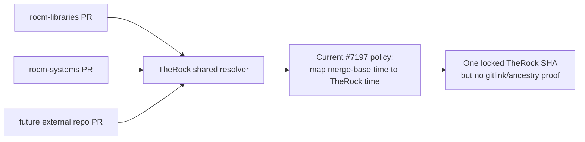
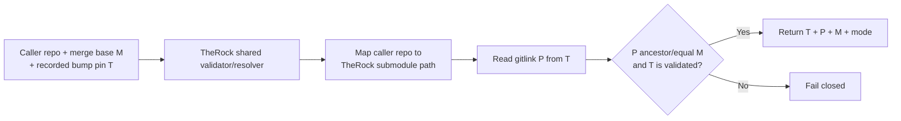

# Architecture Review: ROCm/TheRock#7197

* **PR:** [ROCm/TheRock#7197](https://github.com/ROCm/TheRock/pull/7197)
* **Branch:** `users/geomin12/therock_ref`
* **Base:** `main`
* **Review type:** Architecture / shared external-repository CI
* **Reviewed:** 2026-08-17
* **State:** Open

---

## Summary

Moving shared external-repository CI policy into TheRock is the correct module
boundary. The PR as written, however, copies the timestamp-based resolver from
rocm-libraries without changing its selection invariant. Centralization would
therefore turn a repository-local heuristic into the common policy for
rocm-libraries, rocm-systems, and future callers.

The PR also adds 449 lines of resolver code without moving or adding the tests
that existed beside the original implementation. The result is a second,
currently untested implementation rather than a single shared and validated
source of truth.

---

## Effect of Centralizing the Current Policy

Centralization increases the importance of settling the invariant first:



The desired shared boundary is instead:



For example, a rocm-systems caller should cause the common code to inspect the
`rocm-systems` gitlink, while a rocm-libraries caller should inspect the
`rocm-libraries` gitlink. The generic part is the validation algorithm and
evidence reporting; the external repository's submodule path is explicit data,
not inferred from commit timestamps.

---

## Cross-Repository Git-History Examples

### One TheRock commit can be valid for one caller and invalid for another

Consider a single synchronized TheRock commit:

```text
TheRock T7 tree:
    rocm-libraries -> L7
    rocm-systems   -> S7
    llvm-project   -> V7
```

The two external repositories can have different merge-base relationships:

```text
rocm-libraries:
    L5 --- L6 --- L7 --- ML --- HL
                      L7 <= ML  => T7 is eligible

rocm-systems:
    S5 -------- MS --- HS              (PR/base history)
       \
        S6 --- S7                      (different/newer history)
              S7 <= MS is false        => T7 is ineligible
```

A timestamp-only common resolver can choose `T7` for both callers if their
merge-base dates happen to be nearby. A correct shared resolver gets different
answers because it maps the caller repository to the correct gitlink and runs
the ancestry comparison independently.

```text
resolve(rocm-libraries, ML, T7): compare L7...ML => ancestor => accept
resolve(rocm-systems,   MS, T7): compare S7...MS => diverged => reject
```

### The shared code should validate a stack, not choose independent component pins

TheRock's value is that one commit names the complete tested set:

```text
                     TheRock T7
                  /      |       \
                 /       |        \
       libraries L7   systems S7   LLVM V7 (+ other gitlinks)
```

After validating the caller-specific edge (`L7 <= ML` for a libraries PR), CI
must retain the entire `T7` tree. It should not independently ask for the latest
rocm-systems or LLVM commit, because that constructs a stack TheRock never
represented or tested:

```text
GOOD: T7 => {libraries overlay at PR head, systems S7, LLVM V7, ...}

BAD:  {libraries overlay at PR head,
       latest systems S9,
       latest LLVM V8,
       other pins from T7}
      => synthetic, unvalidated combination
```

### A common timestamp resolver multiplies one silent mismatch

```text
                         shared timestamp policy
                       /          |           \
                      v           v            v
              libraries CI   systems CI   future repo CI
                   T7             T7             T7
                   |              |              |
             L7 ancestry?   S7 ancestry?   X7 ancestry?
             not checked     not checked    not checked
```

Moving the code to TheRock is therefore valuable only if the central contract
makes the caller-specific edge explicit. Otherwise one heuristic becomes a
fleet-wide source of green CI results with unknown baseline provenance.

### Recorded pins keep each repository stable on its own synchronization cadence

```text
TheRock main:
    T5[L=L5,S=S5] --- T6[L=L6,S=S5] --- T7[L=L6,S=S7]
        |                  |                  |
        |                  |                  +--> systems pin update
        |                  +---------------------> libraries pin update
        +----------------------------------------> earlier pins

rocm-libraries develop:
    pin(T5) --- ... --- pin(T6) --- ML
                                resolver => T6

rocm-systems develop:
    pin(T5) --- MS --- ... --- pin(T7)
                resolver => T5 until PR resyncs past pin(T7)
```

The repositories need not advance in lockstep. Each PR uses the last TheRock
baseline recorded in *its own* merge-base history. The common resolver supplies
one implementation of validation and logging, while git history supplies the
per-repository synchronization state.

For the full set of success/failure cases—including integration lag,
non-monotonic commit dates, divergent history, dynamic-candidate drift, and
fail-closed pin validation—see the `Explicit Git-History Examples` section in
[`pr_rocm-libraries_9602_architecture.md`](pr_rocm-libraries_9602_architecture.md).

---

## Overall Assessment

**Status: CHANGES REQUESTED**

Do not propagate this resolver to additional repositories until the selection
contract is based on git history and the shared implementation owns its tests.

---

## Detailed Findings

### BLOCKING: The shared resolver preserves the wrong baseline invariant

The common implementation's
[`resolve_ref()`](https://github.com/ROCm/TheRock/blob/9ddceae6353a1c161284739f4836a218e5d77f05/build_tools/github_actions/resolve_therock_ref.py#L227-L272)
still maps the external repository merge-base timestamp to the first
`TheRock@main` commit at or before that time. It has no external-repository
submodule path, no gitlink lookup, and no ancestry comparison.

This cannot establish that the selected rocm-systems/LLVM/other-source pins are
the stack last validated with the caller's baseline. A TheRock submodule bump
is causal evidence; wall-clock proximity is not. The same concrete evidence
from rocm-libraries#9602 applies: merge base `5bd9db7` caused the resolver to
select TheRock `7c274d3`, whose `rocm-libraries` gitlink was `1aa4641` (18
rocm-libraries commits behind). The resolver never inspected that relationship.

The fallback to live `main` also remains, so an unresolved PR baseline becomes
a moving baseline instead of a hard failure.

**Required action:** Change the shared workflow contract before adoption. It
should resolve or accept a bump-derived TheRock pin, inspect the matching
external-repository gitlink in that TheRock commit, compare it with the caller's
merge base, and fail if the declared relationship is not satisfied. See the
design in [`pr_rocm-libraries_9602_architecture.md`](pr_rocm-libraries_9602_architecture.md).

### BLOCKING: The shared critical path has no tests in this PR

The PR adds `build_tools/github_actions/resolve_therock_ref.py` but no test
file. The PR bot correctly reports:

> Source/code files changed without an accompanying unit test.

The generic TheRock unit-test jobs passing does not demonstrate that this new
module was imported or exercised. The original rocm-libraries implementation
had tests for override, PR, live-tip, fallback, staleness, and summary modes;
none moved with the supposed common implementation. There are also no tests
for the new reusable-workflow boundary.

**Required action:** Move the resolver tests into TheRock with the
implementation, then add cases for the actual graph contract:

- candidate gitlink equals the merge base;
- candidate gitlink is an ancestor of the merge base;
- candidate gitlink is newer than or divergent from the merge base and is
  rejected;
- multiple synchronization candidates use the documented topology tie-break;
- no eligible candidate fails closed;
- explicit override is validated under a clearly documented policy; and
- reusable-workflow inputs/outputs preserve the full SHA and evidence fields.

### IMPORTANT: Copying the script does not yet create a single source of truth

The PR adds a new TheRock copy while the merged rocm-libraries copy and its
tests remain in place. It does not migrate a caller or remove/deprecate the
local implementation. Any correction to retry behavior, API handling, summary
format, logging, or baseline policy must therefore be made twice until a later
change happens.

**Recommendation:** Treat this as a move with a coordinated consumer migration,
not a copy. Put the reusable logic and tests in TheRock, keep external-repo
wrappers declarative and small, and state the migration/removal sequence in the
PR. Do not let multiple repositories own forks of the decision algorithm.

### IMPORTANT: Logging still does not show what the resolver considered or why it decided

The new module configures `logging` and logs retries/final output, but the
successful selection path at
[`resolve_ref()`](https://github.com/ROCm/TheRock/blob/9ddceae6353a1c161284739f4836a218e5d77f05/build_tools/github_actions/resolve_therock_ref.py#L227-L272)
contains no decision logging. A successful run will not show the discovered
merge base, cutoff/candidates, or validation evidence while the script runs.
The step summary is written only after resolution, so it is unavailable when
resolution fails.

**Recommendation:** Emit structured INFO logs for the event mode, caller repo,
base/head, merge base, each candidate and its external gitlink, ancestry result,
selection/rejection reason, and final output. Emit warnings only for genuinely
non-fatal conditions; failure to establish a validated baseline should raise.

### IMPORTANT: The checked-out resolver implementation is itself floating

The reusable workflow
[`checks out ROCm/TheRock without a ref`](https://github.com/ROCm/TheRock/blob/9ddceae6353a1c161284739f4836a218e5d77f05/.github/workflows/resolve_therock_ref.yml#L25-L30).
Because this is a checkout of a repository other than the caller repository,
`actions/checkout` resolves its default branch when `ref` is empty. The script
executed by a run can therefore differ from the revision at which the reusable
workflow definition was loaded, recreating a smaller form of within-run drift.

**Recommendation:** Ensure the script is loaded from the same immutable TheRock
revision as the reusable workflow, or package the resolver so the workflow and
implementation are versioned together. The workflow's selected source-stack
SHA and the revision of the resolver code should both be visible in logs.

---

## Recommended Shared Contract

The common workflow should make the evidence explicit instead of returning one
opaque SHA. Suggested outputs are:

| Output | Meaning |
|---|---|
| `therock-ref` | Exact TheRock commit used for all downstream jobs |
| `external-merge-base` | Caller repository merge base used for the decision |
| `external-gitlink-ref` | Caller repository gitlink stored by `therock-ref` |
| `selection-mode` | Recorded pin, validated override, or another explicit mode |

For the preferred recorded-pin design:

1. Read the TheRock pin from the caller repository at its merge base.
2. Verify that pin is on TheRock main (or another explicitly allowed release
   line).
3. Read the caller repository's gitlink from that TheRock commit.
4. Verify the gitlink is equal to or an ancestor of the caller merge base.
5. Return and log all three SHAs; fail closed on any mismatch.

The existing bump automation can auto-approve/merge narrowly scoped
back-reference PRs after those same checks. This retains stable PR baselines
while removing routine human latency.

---

## CI Evidence

- `therock-pr-bot` is failing because the PR description lacks a required issue
  reference. The bot also warns that the new code has no unit test.
- Generic Linux/Windows TheRock unit-test jobs passed, but no changed or new test
  file exercises this resolver.
- Pre-commit and gitleaks passed.
- No end-to-end caller run is linked that invokes the new reusable workflow from
  an external repository and validates its outputs.

---

## Required Actions

1. Replace the timestamp policy with a documented gitlink/ancestry or recorded
   bump-pin policy and fail closed when it cannot be proven.
2. Move/add the resolver tests in TheRock, including graph-validation and
   reusable-workflow cases.
3. Add an issue reference and end-to-end external-caller evidence.

## Recommended Actions

1. Migrate callers and retire repository-local resolver copies as a coordinated
   sequence.
2. Add complete decision logging.
3. Version the reusable workflow and its script from the same immutable TheRock
   revision.

---

## Conclusion

The location is right; the policy and packaging are not ready to become common
infrastructure. Revise PR #7197 around the bump-derived graph relationship,
bring the tests with the implementation, and make the decision evidence visible
before any external repository adopts it.

---

*Review generated with OpenAI Codex.*
