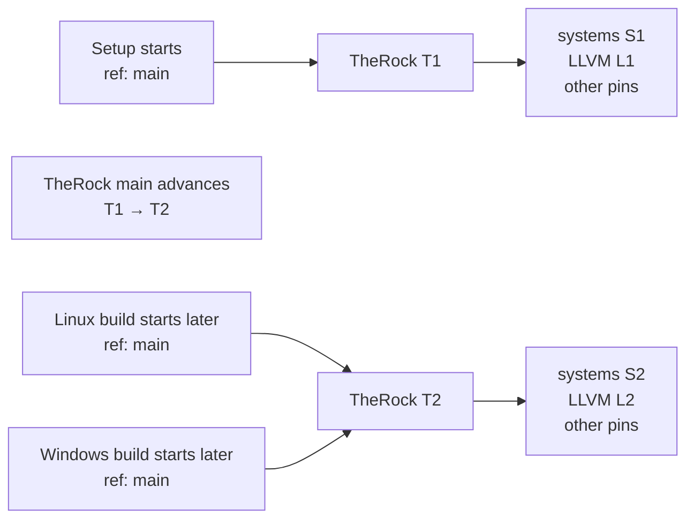
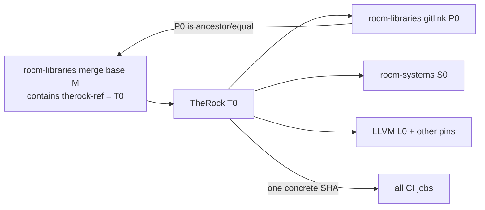
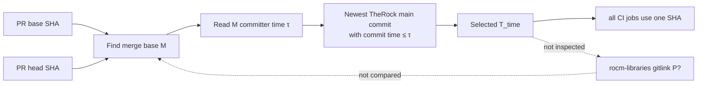
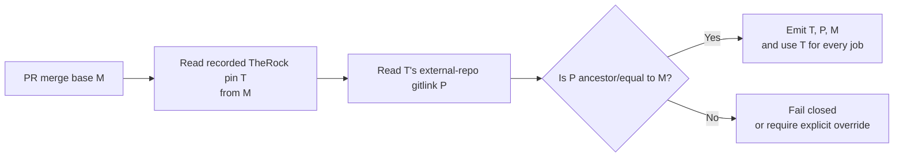
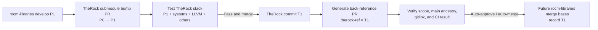
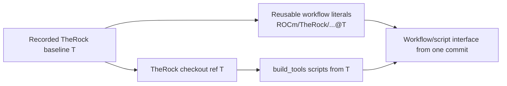
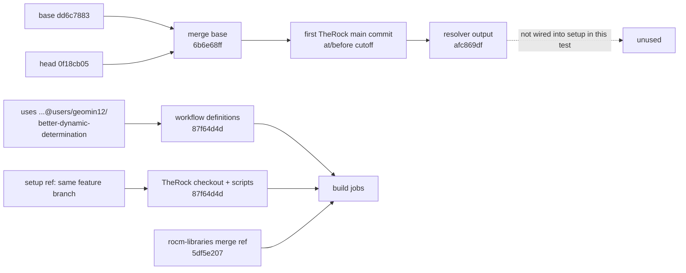

# Architecture Review: ROCm/rocm-libraries#9602

* **PR:** [ROCm/rocm-libraries#9602](https://github.com/ROCm/rocm-libraries/pull/9602)
* **Issue:** [ROCm/rocm-libraries#9601](https://github.com/ROCm/rocm-libraries/issues/9601)
* **Branch:** `users/tony-davis/therock-ref-merge-base`
* **Base:** `develop`
* **Review type:** Architecture / dependency baseline selection
* **Reviewed:** 2026-08-17
* **State:** Merged on 2026-08-04 (this is a retrospective design review)

---

## Summary

The PR fixes one real problem: one workflow run now resolves a single concrete
TheRock SHA and passes it through all downstream jobs, eliminating within-run
drift. The pull-request selection policy, however, does not identify the
TheRock stack that the external repository was last validated with. It chooses
the newest TheRock commit whose **committer timestamp** is no later than the
external repository merge-base timestamp.

That is a chronological heuristic, not a repository synchronization
relationship. The code never reads TheRock's `rocm-libraries` gitlink and never
checks whether that gitlink is equal to or an ancestor of the PR merge base.
The existing TheRock bump and back-reference automation does record such a
causal relationship, so eliminating that mapping loses the strongest evidence
available.

There is also a second, independent versioning boundary. The caller loads
reusable workflow definitions from `ROCm/TheRock@main`, while those workflows
can check out and execute `build_tools` scripts from the resolver-selected
TheRock commit. A workflow and the script it invokes are one interface and must
come from compatible revisions. Locking only the source checkout does not lock
the CI control plane.

---

## Behavior Comparison

There are two different "before" states worth separating. The multi-arch
workflow immediately before #9602 used live `main` in each job. The established
TheRock CI path separately used a hardcoded pin maintained by bump automation.

### Before #9602: multi-arch jobs could resolve different stacks



Example: setup could configure against `T1`, then a TheRock merge moves `main`
to `T2` before a downstream job checks out its sources. The jobs belong to one
workflow run but do not necessarily build one source stack. #9602 correctly
fixes this part by resolving once and passing a concrete SHA everywhere.

### Existing pinned CI: stable, causal, but only as fresh as the bump-backreference process



At #9602's base, the recorded pin was TheRock `2d0da43`, whose
`rocm-libraries` gitlink was `a777282`. That pin was stale, but its meaning was
clear: it was a specific TheRock submodule bump commit recorded back into
rocm-libraries history. The staleness came from generated back-reference PRs
waiting for humans, not from an inability to represent the relationship.

### What #9602 changed it to: stable selection by time, without graph validation



Concrete example from the demonstration run:

```text
M      = rocm-libraries 5bd9db7 (17:43 UTC)
T_time = TheRock       7c274d3 (17:06 UTC)
T_time's rocm-libraries gitlink = 1aa4641
1aa4641 is 18 commits behind M
```

This is deterministic enough to freeze the run, but it does not answer why
`7c274d3` is the validated baseline for `5bd9db7`. The arrows that would prove
that relationship are precisely the dotted, unimplemented part of the diagram.

### Recommended: lock once using the recorded bump relationship, then validate it



The update loop should keep that recorded relationship fresh:



This gives the desired behavior in plain terms: a PR stays on the baseline
recorded in its merge-base history; bump PR automation advances that baseline
only after TheRock validates a synchronized stack; and all jobs within the run
use the same SHA.

The workflow definition and implementation must be versioned as a pair too:



GitHub does not allow an expression in `jobs.<job_id>.uses`, so a resolver job
cannot dynamically turn `uses: ...@main` into `uses: ...@${{ needs.resolve... }}`.
The literal reusable-workflow refs therefore need to be updated by the same
bump/back-reference PR that records the source baseline, or the CI control
plane must be deliberately separated behind a stable, versioned API.

---

## Explicit Git-History Examples

The examples below use these symbols:

- `M`: the external repository PR merge base;
- `Tn[R=Pn]`: TheRock commit `Tn` whose external-repository gitlink is `Pn`;
- `P <= M`: `P` is equal to or an ancestor of `M`; and
- `pin(Tn)`: an external-repository commit recording `Tn` as its CI baseline.

The horizontal order is **git parent/child history**. Times in parentheses are
committer timestamps, which are metadata and are not the graph itself.

### Case 1: The timestamp heuristic happens to choose a compatible stack

```text
rocm-libraries develop:
    P0 -------- P1 -------- M -------- H (PR head)
                 \_________/
                    P1 <= M

TheRock main:
    T0[R=P0] --- T1[R=P1] --- T2[R=P1, systems/LLVM advanced]
    (08:00)      (09:00)      (09:30)

M committer time: 10:00
timestamp result: T2
```

This case works because `T2` happens to contain `P1`, and `P1` is an ancestor
of `M`. TheRock CI also had an opportunity to validate the `T2` source bundle.
The problem is that the resolver does not check either fact—it succeeds here by
the normal cadence of the two repositories, not by enforcing an invariant.

### Case 2: Normal integration lag excludes the synchronization commit

```text
rocm-libraries develop:
    P0 ---------------- M ---------------- H
                       (10:00)

TheRock main:
    T0[R=P0] --- T1[R=P0] ---------------- B1[R=M]
    (08:00)      (09:55)                    (11:00)
                    ^                          ^
                    |                          |
          timestamp chooses this      bump CI validates M here
```

`B1` cannot exist until after `M` exists and a bump PR has run. Therefore a
rule requiring `TheRock time <= M time` necessarily excludes the commit that
most directly records and validates `M`. It selects `T1`, a stack tested with
`P0`, and describes the result using temporal skew rather than the actual
`T1[R=P0]` relationship.

This is not an exotic failure; it is the expected ordering of asynchronous
repository synchronization.

### Case 3: Commit timestamps do not define TheRock history order

Git permits child commits to have timestamps older than their parents—for
example after cherry-picking, importing, or deliberately preserving dates:

```text
TheRock main graph (parent order):
    T0[R=P0] -------- T1[R=P1] -------- T2[R=P2]
    date 08:00         date 10:30        date 09:30
                                           ^
                                           child of T1 despite older timestamp

External merge base M date: 10:00
```

A query filtered only by `until=10:00` can admit `T2` by timestamp even though
`T2` is topologically after `T1`, whose timestamp is outside the cutoff. In
other words, "commit date no later than M" does not mean "state of main that
existed when M was created." Git ancestry is authoritative; dates are labels
on graph nodes.

### Case 4: Similar timestamps can hide divergent source history

```text
rocm-libraries:
                         M --- H              (develop / PR history)
                        /
    P0 ----------------+
                        \
                         Q1 --- Q2             (release or divergent history)

TheRock main:
    T0[R=P0] --- T1[R=Q2]
                  (timestamp is just before M)
```

The timestamp resolver accepts `T1`. But `Q2` is not an ancestor of `M`, so
TheRock validated `T1` with a different rocm-libraries history than the PR's
baseline. A graph-aware resolver rejects it:

```text
compare Q2...M => diverged
eligibility     => false
result          => fail closed or use a different recorded baseline
```

This is why merely reading the gitlink is insufficient; the gitlink must be
compared with the caller's merge base.

### Case 5: "Newest compatible gitlink" is valid but can still move between reruns

Suppose `M` already contains both `P0` and `P1`, but TheRock has not caught up
when the PR first runs:

```text
rocm-libraries develop:
    P0 -------- P1 -------- M -------- H
    P0 <= M     P1 <= M

TheRock at PR run 1:
    B0[R=P0]
    newest eligible => B0

TheRock later, same unchanged PR:
    B0[R=P0] -------- B1[R=P1]
                       ^ bump lands after run 1
    newest eligible => B1
```

This algorithm is much safer than timestamps because both candidates have a
proven ancestry relationship. It still violates the promise that an unchanged
PR keeps the same baseline: run 1 selects `B0`, while run 2 selects `B1`.

Avoiding that movement requires either durable per-PR state or a mapping already
present in immutable history. The recorded back-reference pin provides the
latter without adding a separate database.

### Case 6: A pin recorded at the merge base stays frozen until the PR resyncs

```text
TheRock main:
    T0[R=P0] ---------------- T1[R=P1]
       |                          |
       | bump automation          | later bump automation
       v                          v

rocm-libraries develop:
    P0 --- pin(T0) --- P1 --- M -------- pin(T1) --- D
                               \
                                H1 --- H2            (unchanged PR ancestry)
```

For the PR whose merge base is `M`:

```text
run 1: read pin at M => T0
run 2 after T1 lands: merge base is still M => T0
run 3 after merging/rebasing develop to D: new merge base D => T1
```

This has exactly the stability semantics sought by #9602. The baseline changes
only when the PR author changes the branch's relationship to the base branch.
Unlike the timestamp method, the selected SHA is the result of an explicit bump
feedback edge stored in git history.

### Case 7: Validation makes a recorded pin fail safely if automation is wrong

A stored pin should be evidence, not blindly trusted:

```text
rocm-libraries merge base:
    P0 -------- M, containing pin(Tbad)

TheRock Tbad:
    Tbad[R=Q2, systems=S7, LLVM=L9]

ancestry check:
    Q2 <= M ?  NO (diverged)
```

Expected resolver behavior:

```text
ERROR: TheRock Tbad pins rocm-libraries Q2, which is not an ancestor of M.
       Refusing to choose an unvalidated baseline.
       Correct the bump pin or provide an explicitly validated override.
```

The current implementation would never notice this mismatch. The proposed
design logs `Tbad`, `Q2`, and `M`, then stops before expensive build jobs start.

### Case 8: Workflow and script refs can be individually valid but incompatible together

TheRock history already contains a concrete atomic interface change on the
`users/geomin12/granular-artifact-reuse` line at
[`c2aebfa`](https://github.com/ROCm/TheRock/commit/c2aebfae4b00e79d763e9f736b39c28d1be9d48c):

```text
e9e1671:
    workflow calls: configure_stage.py --projects=...
    script accepts: --projects

        |
        | c2aebfa: rename --projects to --artifacts in both files
        v

c2aebfa:
    workflow calls: configure_stage.py --artifacts=...
    script accepts: --artifacts
```

Each commit is internally consistent. Splitting the workflow-definition ref
`W` from the checked-out source/script ref `T` creates two failure modes:

```text
W = c2aebfa, T = e9e1671
    new workflow + old script
    => configure_stage.py: error: unrecognized arguments: --artifacts=...

W = e9e1671, T = c2aebfa
    old workflow + new script
    => configure_stage.py: error: unrecognized arguments: --projects=...

W = T = e9e1671, or W = T = c2aebfa
    => interface is coherent
```

This is exactly the class of failure enabled by loading
`multi_arch_build_portable_linux_artifacts.yml@main` but running
`build_tools/configure_stage.py` from some independently selected older SHA.
The fact that the rename was correctly atomic inside TheRock does not help if
external CI tears that commit apart at runtime.

### Case 9: Run 31760958655 computed one ref but executed another

[Workflow run 31760958655](https://github.com/ROCm/rocm-libraries/actions/runs/31760958655)
was a test run from rocm-libraries PR #10753. It is useful because the API and
job logs expose every ref boundary:

| Role | Ref selected or used | Evidence |
|---|---|---|
| Resolver base input | `dd6c7883` | `BASE_SHA` in resolver job |
| Resolver head input | `0f18cb05` | `HEAD_SHA` in resolver job |
| Computed rocm-libraries merge base `M` | `6b6e68ff` at 2026-08-13 17:14:37 UTC | GitHub compare API |
| Only TheRock candidate requested | `afc869df` at 2026-08-13 16:04:50 UTC | `/commits?sha=main&until=...&per_page=1` |
| Resolver output | `afc869df` | `therock_ref` job output |
| Reusable workflow definition `W` | `87f64d4d` | Run API `referenced_workflows` for all called workflows |
| TheRock checkout/script ref `T` | `87f64d4d` | setup output and downstream checkout logs |
| External rocm-libraries overlay | merge ref `5df5e207` | build checkout log |

If the same GitHub query is expanded to five results, the response begins:

```text
afc869df  2026-08-13 16:04:50 UTC  fix(ci): Add -Xarch_host flags...
97a0346f  2026-08-13 15:29:49 UTC  Add hipfile to Linux library preload list
47947a1b  2026-08-12 19:40:51 UTC  Quartz action update
6113c9a6  2026-08-12 17:13:56 UTC  artifact inspection by ref/run
c6170502  2026-08-12 16:09:19 UTC  regenerate consumer graph
```

The implementation does not fetch or evaluate that list: it sets
`per_page=1`, accepts `afc869df`, and never reads any candidate's
`rocm-libraries` gitlink. In code, its considered set for this run was therefore
just `{afc869df}`.

The control flow was:



The recorded pin at `M` was TheRock `36efe519`, whose rocm-libraries gitlink
was `f857d8e2` (214 commits behind `M`). The timestamp resolver instead returned
`afc869df`, whose gitlinks were:

```text
rocm-libraries -> 67811f1e  (142 commits behind M)
rocm-systems   -> 5bc651a8
amd-llvm       -> a01cdbd9
```

The actually checked-out `87f64d4d` happened to contain those same three
gitlinks, so this run did not change dependency pins between `afc869df` and
`87f64d4d`. That compatibility was incidental; the two TheRock commits are on
diverged histories, and only the latter's workflows and scripts executed.

This means the run does **not** provide end-to-end evidence that the resolver's
chosen SHA controls the build. It demonstrates that the algorithm returned
`afc869df`, then the test wiring bypassed it. The four Linux math-libs jobs
failed later because rocFFT could not find `fftw3.h`; they did not fail from a
workflow/script argument mismatch.

### Resulting behavior matrix

| Design | Uses a causal git relationship? | Stable for unchanged PR? | Detects divergence? | Main failure mode |
|---|---:|---:|---:|---|
| Per-job live `main` | No | No, even within one run | No | Jobs build different stacks |
| One SHA by merge-base timestamp (#9602) | No | Usually | No | Chronological approximation is mistaken for validation |
| Newest TheRock commit with compatible gitlink | Yes | No, if a later eligible bump lands | Yes | Baseline advances between reruns |
| Pin recorded at merge base, no validation | Yes, by convention | Yes | No | Automation error is consumed silently |
| Pin recorded at merge base + gitlink ancestry validation | Yes, enforced | Yes | Yes | Stale pin, handled by bump automation/SLA |

The dependency-baseline matrix is necessary but not sufficient: whichever
design supplies `T` must also ensure the reusable workflow definition `W` and
the scripts executed from `T` satisfy a documented compatibility invariant.

---

## Overall Assessment

**Status: CHANGES REQUESTED** (follow-up/replacement required because the PR is
already merged)

The per-run locking should be kept. The timestamp-based automatic selection
should not be treated as a validated dependency baseline and should be replaced
before it becomes the common policy for other external repositories.

---

## Detailed Findings

### BLOCKING: The selection rule does not prove that the selected stack was validated with the PR baseline

[`resolve_ref()`](https://github.com/ROCm/rocm-libraries/blob/a69d3716d5709093349679e13b6ffb8a850e824a/.github/scripts/resolve_therock_ref.py#L173-L218)
does the following for a pull request:

1. Find the external repository merge base.
2. Read that commit's committer timestamp.
3. Ask for the first `ROCm/TheRock@main` commit at or before that timestamp.

There is no lookup of TheRock's `rocm-libraries` submodule entry and no ancestry
comparison in `ROCm/rocm-libraries`. Consequently, the returned SHA means only
"nearby in wall-clock time." It does not mean "the stack that incorporated and
validated this repository baseline."

The PR's own demonstration makes the gap concrete:

| Item | Commit | Evidence |
|---|---|---|
| rocm-libraries PR merge base | [`5bd9db75e640`](https://github.com/ROCm/rocm-libraries/commit/5bd9db75e64032aec711661ca8965a5e53ccfa18) | Committed 2026-07-20 17:43 UTC |
| TheRock commit selected by the resolver | [`7c274d31805e`](https://github.com/ROCm/TheRock/commit/7c274d31805e8ee90b8b845cd6eb2f12728ebce3) | Committed 2026-07-20 17:06 UTC |
| `rocm-libraries` gitlink in that TheRock commit | [`1aa464152f7b`](https://github.com/ROCm/rocm-libraries/commit/1aa464152f7ba1bbb762f7e0d81388b3f9742062) | 18 rocm-libraries commits behind the merge base |
| Next TheRock submodule bump containing the merge base in its ancestry | [`cb90066183b9`](https://github.com/ROCm/TheRock/commit/cb90066183b93a80ca4d8ee7b88e7e4bdf3c740b) | Bumped the gitlink to `3b121fd`, five commits after `5bd9db7` |

The selected TheRock commit may be a usable stack, and TheRock main should have
tested its own gitlinks. What the resolver cannot establish is that it is the
appropriate last-validated stack for `5bd9db7`. In particular, a synchronization
commit that incorporates an external-repository commit necessarily happens
*after* that external commit; an `at or before the external commit time` cutoff
systematically excludes the synchronization event that supplies the evidence.

Commit timestamps are also not graph ordering. Cherry-picks, rebases, delayed
merges, and rewritten committer dates can all make chronological proximity
diverge from repository ancestry.

**Required action:** Replace the timestamp mapping with an explicit, validated
mapping. The preferred design is to use the TheRock ref recorded in the
external repository at the PR merge base, then validate it against TheRock's
gitlink. If a fully dynamic resolver is retained, it must inspect TheRock's
submodule history and prove the selected gitlink is compatible with the merge
base; it must not infer compatibility from timestamps.

### BLOCKING: Reusable workflows and the scripts they execute are selected from different revisions

The merged caller loads setup, Linux, and Windows reusable workflows from
[`ROCm/TheRock@main`](https://github.com/ROCm/rocm-libraries/blob/a69d3716d5709093349679e13b6ffb8a850e824a/.github/workflows/therock-multi-arch-ci.yml#L145-L208),
but passes the dynamically resolved TheRock SHA as the checkout `ref`. The
called workflow definition can therefore be from revision `W` while
`build_tools/configure_stage.py` and the rest of the source tree come from
revision `T`.

That pair is not guaranteed to be compatible. TheRock commit
[`c2aebfa`](https://github.com/ROCm/TheRock/commit/c2aebfae4b00e79d763e9f736b39c28d1be9d48c)
changed
`multi_arch_build_portable_linux_artifacts.yml` from invoking
`configure_stage.py --projects` to `--artifacts` in the same commit that changed
the script's parser. Loading the workflow after that commit with a checkout
before it produces an immediate unknown-argument error; reversing the refs
produces the inverse error.

This cannot be fixed by substituting the resolver output into `uses`: GitHub's
[`jobs.<job_id>.uses` syntax](https://docs.github.com/en/actions/reference/workflows-and-actions/workflow-syntax-for-github-actions#jobsjob_iduses)
requires a literal ref and does not allow contexts or expressions. The version
decision must therefore exist before workflow expansion.

**Required action:** Define and enforce a control-plane versioning contract.
The preferred bump-derived design should atomically update literal reusable
workflow refs and the recorded TheRock source baseline to the same immutable
commit. An acceptable alternative is a separately pinned workflow/control-plane
release whose scripts also come from that control-plane revision and whose API
compatibility with source baseline `T` is tested and versioned. Do not load
workflow code from live `main` and execute arbitrary CI scripts from `T`.

### BLOCKING: Falling back to live `main` violates the promised per-PR stability

When no TheRock commit is returned by the timestamp query, the resolver
[falls back to the live tip](https://github.com/ROCm/rocm-libraries/blob/a69d3716d5709093349679e13b6ffb8a850e824a/.github/scripts/resolve_therock_ref.py#L202-L218)
and merely emits a warning. The tests explicitly preserve this behavior.

This is the exact failure mode the PR is intended to prevent: rerunning an
unchanged PR can select a different TheRock commit. It also converts an inability
to establish a baseline into a green build against an unvalidated choice.

**Required action:** Fail closed when no eligible baseline can be established.
Require an explicit override or a repaired baseline mapping instead of silently
switching to live `main`.

### IMPORTANT: The resolver does not emit an auditable decision trace

The successful demonstration job logged the input SHAs and only the final
output:

```text
BASE_SHA: 5239ffcde0ed9af3290d9b40da8e3a7884375f3f
HEAD_SHA: cb120a28ecccf941bac93663f3721d38040ef63b
INFO:root:Setting github output:
{'therock_ref': '7c274d31805e8ee90b8b845cd6eb2f12728ebce3'}
```

The step summary is useful after success, but it is not a live diagnostic and
will not explain a failure before summary generation. There is no trace of the
mode, discovered merge base, cutoff, candidates considered, submodule gitlink,
ancestry result, or fallback decision.

Run `31760958655` behaves the same way. Its resolver received base `dd6c7883`
and head `0f18cb05`, then logged only the final output `afc869df`. Reconstructing
merge base `6b6e68ff`, its timestamp cutoff, and the fact that the code requests
only one candidate required separate API calls. The logs also did not reveal
that setup ignored the output and selected `87f64d4d`; that was visible only by
cross-referencing the caller YAML, run-level `referenced_workflows`, and
downstream checkout logs.

**Recommendation:** Log each decision input and invariant check as it happens.
At minimum log the event/mode, source repository, base/head, merge base, selected
TheRock candidate, candidate gitlink for the external repository, ancestry
comparison result, and the final reason for selection or rejection. Do not log
the token.

---

## Recommended Design

### Preferred: preserve the back-reference pin and automate its maintenance

The existing chain already encodes the relationship that the resolver needs:

1. A TheRock bump PR advances the `rocm-libraries` gitlink and runs TheRock CI
   with the complete set of pinned sources.
2. After that bump merges, [`bump_automation.py`](https://github.com/ROCm/TheRock/blob/main/build_tools/github_actions/bump_automation.py)
   creates a rocm-libraries PR that records the exact merged TheRock commit in
   `.github/actions/ci-env/action.yml`.
3. A rocm-libraries PR merge base therefore contains the last accepted TheRock
   baseline known at that point in repository history.

[rocm-libraries#10558](https://github.com/ROCm/rocm-libraries/pull/10558) is an
example: TheRock commit `f5a34f5` bumped its `rocm-libraries` gitlink to
`67811f1`, and the generated back-reference PR updates the CI pin to that exact
TheRock commit. The fact that this PR remained open is an automation/ownership
latency problem, not a reason to discard the causal mapping.

Automate approval/merge for these narrowly scoped PRs after verifying:

- the proposed TheRock SHA is on `ROCm/TheRock@main`;
- its external-repository gitlink matches the bump that triggered the PR;
- that gitlink is an ancestor of or equal to the destination branch;
- required TheRock CI for the bump succeeded; and
- the PR changes only the expected pin.

Developer rotations can own failures and a maximum-lag SLA rather than routine
manual merging.

### If dynamic resolution is required

Define the policy in graph terms:

- Let `M` be the external repository PR merge base.
- For a candidate TheRock synchronization commit `T`, read the external repo
  gitlink `P` from `T`.
- Require `P == M` or `P` to be an ancestor of `M` (with the exact rule stated
  explicitly).
- Select among eligible **submodule bump/validated milestone commits** by a
  documented git-history rule, not by timestamps.
- Fail if no eligible validated candidate exists.

The workflow should output all of `T`, `P`, and `M`, so downstream logs show the
validated relationship rather than only the final TheRock SHA.

### Keep the CI control plane coherent

The baseline output alone cannot select a reusable workflow dynamically because
GitHub expands `jobs.<job_id>.uses` before resolver job outputs exist. Choose one
of these explicit models:

1. **Preferred: one TheRock commit.** Bump automation writes immutable
   `uses: ROCm/TheRock/...@T` literals and the source baseline `T` together.
   Workflows and scripts are then exactly the pair tested in TheRock.
2. **Versioned control plane.** Pin workflow definitions and every CI script
   they invoke to an immutable control-plane release `C`; treat build source
   `T` as data and maintain a tested `C`-to-`T` compatibility contract.

The current `workflow@main + scripts@T` model is neither: `main` moves without
the external repository's bump history, and the called workflows execute code
from the independently selected source checkout.

---

## Validation Performed

- Inspected the PR, issue, full diff, reviews, comments, and all reported PR
  checks.
- Inspected the pull-request demonstration run `29780090396`, including the
  `Resolve TheRock ref` job log.
- Traced workflow run `31760958655` through its resolver inputs, merge base,
  one-result TheRock query, run-level `referenced_workflows`, setup output, and
  downstream source checkouts. The resolver returned `afc869df`, while the test
  workflow actually used `87f64d4d` for both workflow definitions and scripts.
- Inspected TheRock commit `c2aebfa`, which atomically renamed the
  `configure_stage.py` workflow/script interface from `--projects` to
  `--artifacts`, and verified both mixed-ref directions are incompatible.
- Queried the gitlink stored by TheRock commit `7c274d3` and compared
  `1aa4641...5bd9db7` through GitHub's compare API (`5bd9db7` is 18 commits
  ahead).
- Inspected TheRock submodule bump history around the demonstrated merge base.
- Ran the currently merged resolver tests locally:
  `D:\projects\TheRock\.venv\Scripts\python.exe -m pytest .github/scripts/tests/resolve_therock_ref_test.py -q`
  — **11 passed in 0.33s**. These tests validate the implemented timestamp
  policy; they do not validate a gitlink/ancestry policy.

---

## Conclusion

The answer to the central question is **no**: PR #9602 does not select TheRock
by comparing TheRock's external-repository submodule pin with the PR merge
base. It selects by committer time. It also does not make the reusable workflow
definition and checked-out CI implementation one revision. Keep the useful
single-SHA plumbing, but replace the selection policy with the bump-derived pin
or another explicit git-history invariant and version the CI control plane
coherently before propagating it across ROCm repositories.

---

*Review generated with OpenAI Codex.*
